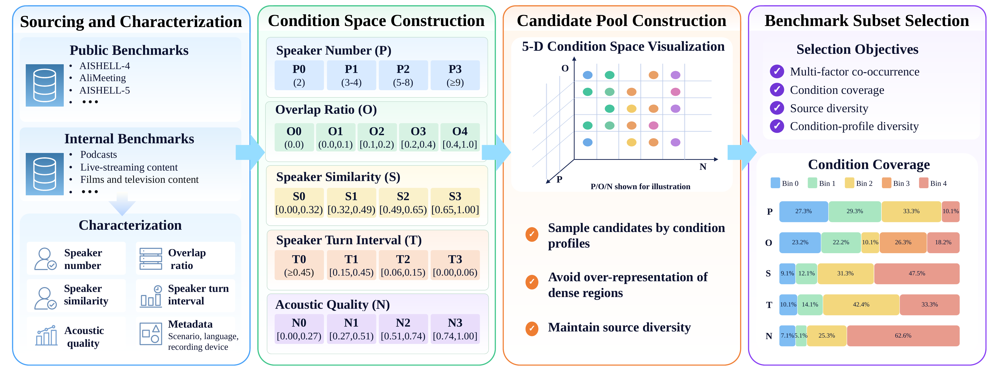

<h2>MS-Bench: A Condition-Stratified Multi-Speaker ASR Benchmark</h2>

**MS-Bench** is a condition-stratified benchmark for fine-grained multi-speaker automatic speech recognition (MSASR) evaluation. It integrates public and internal benchmarks across diverse scenarios, languages, and recording devices, with recordings stratified by **speaker number, overlap ratio, speaker similarity, speaker turn interval, and acoustic quality**.

The leaderboard, detailed evaluation results, and Condition Explorer are available on the [demo page](https://aslp-lab.github.io/MS-Bench/).

## Benchmark Construction

  

Recordings are collected and characterized, organized into a condition space and candidate pool, and selected for condition coverage and source diversity.

## Benchmark Overview

| Total duration | Condition dimensions | Speakers | Duration-weighted overlap | Evaluated systems |
|:--:|:--:|:--:|:--:|:--:|
| **32.72 h** | **5** | **2-14** | **21.87%** | **7** |

MS-Bench covers meetings, spontaneous conversations, films and television content, podcasts, dinner-party conversations, educational content, live-streaming content, in-vehicle interactions, and smart-glasses interactions. The recordings mainly contain Chinese and English speech, with additional samples in Portuguese, Japanese, Thai, Italian, and Spanish. Recording devices include microphone arrays, in-cabin recording systems, and mobile devices.

## Condition Space

Each tier shows its condition range, recording count, and percentage of the 99 recordings.

| Dimension | Tier 0 | Tier 1 | Tier 2 | Tier 3 | Tier 4 |
|:--|:--:|:--:|:--:|:--:|:--:|
| **P: Speaker number** Number of reference speakers | **P0** 2 speakers 27 / 27.3% | **P1** 3-4 speakers 29 / 29.3% | **P2** 5-8 speakers 33 / 33.3% | **P3** ≥9 speakers 10 / 10.1% | - |
| **O: Overlap ratio** Recording-level overlap | **O0** 0 23 / 23.2% | **O1** (0, 0.10) 22 / 22.2% | **O2** [0.10, 0.20) 10 / 10.1% | **O3** [0.20, 0.40) 26 / 26.3% | **O4** [0.40, 1.00] 18 / 18.2% |
| **S: Speaker similarity** Maximum pairwise cosine similarity | **S0** [0.00, 0.32) 9 / 9.1% | **S1** [0.32, 0.49) 12 / 12.1% | **S2** [0.49, 0.65) 31 / 31.3% | **S3** [0.65, 1.00] 47 / 47.5% | - |
| **T: Speaker turn interval** 25th percentile; higher tiers mean shorter intervals | **T0** ≥0.45 s 10 / 10.1% | **T1** [0.15, 0.45) s 14 / 14.1% | **T2** [0.06, 0.15) s 42 / 42.4% | **T3** [0.00, 0.06) s 33 / 33.3% | - |
| **N: Acoustic quality** d_N; higher tiers mean poorer quality | **N0** [0.00, 0.27) 7 / 7.1% | **N1** [0.27, 0.51) 5 / 5.1% | **N2** [0.51, 0.74) 25 / 25.3% | **N3** [0.74, 1.00] 62 / 62.6% | - |

View the interactive condition distributions on the [demo page](https://aslp-lab.github.io/MS-Bench/demo.html#overview).

Acoustic quality is represented by `d_N = 1 - (p_D + p_N) / 2`, where `p_D` and `p_N` are the percentile ranks of DNSMOS P.835 and NISQA scores. Larger values indicate poorer acoustic quality.
